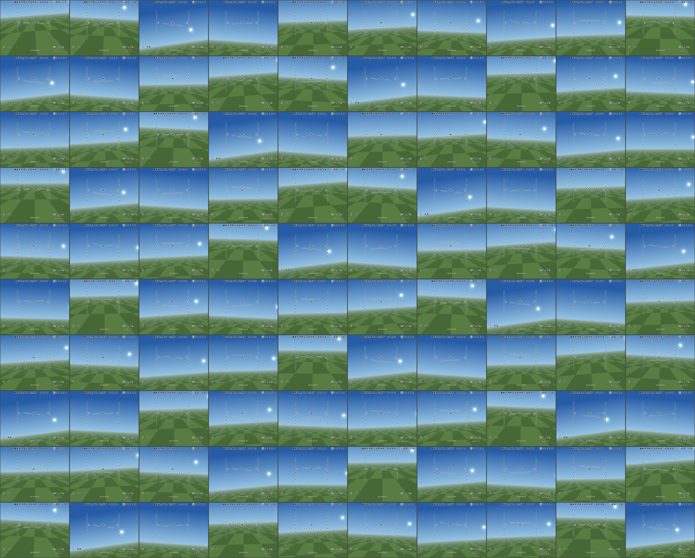

# cudaflight

**Real Betaflight firmware, running as thousands of parallel instances on a
GPU.**


*Every tile is a real firmware instance drawing its own OSD on the GPU
(`wall-of-betaflight` demo).*

cudaflight is a fork of
[Betaflight](https://github.com/betaflight/betaflight), the open-source
flight controller firmware. It exists for reinforcement learning and
sim-to-real research. Most training setups use a hand-written model of the
flight controller. cudaflight steps the real firmware instead — the same PID
loops, rates, mixer, filters, and OSD that fly the physical aircraft.

## Approach

- **Deterministic firmware build.** The `SITL_LOCKSTEP` target runs the
  firmware with no scheduler jitter and no wall clock. A harness steps it in
  lockstep with a physics model.
- **One binary, N instances.** An LLVM pass (the *instancer*) packs all
  mutable firmware state into one relocatable image. Instances differ only in
  a base pointer.
- **CPU and GPU backends.** The instanced firmware is compiled to native code
  (`libcpuflight.so`) or to NVPTX (`fw.fatbin`). On the GPU, one thread is
  one complete flight controller.
- **Python package.** JAX and PyTorch environments with zero-copy on-device
  buffers, plus finite-difference Jacobian kernels for differentiable
  rollouts.

The firmware itself is not modified. All upstream flight-controller targets
still build, and the fork follows upstream release tags (currently
`2026.6.1`).

## Quick start

Prebuilt wheels (Linux x86_64, glibc 2.39+) are on the
[Releases](https://github.com/synaptech-solutions/cudaflight/releases) page —
`pip install` the wheel URL directly.

```python
from cudaflight.jax_env import BetaflightJaxEnv

env = BetaflightJaxEnv(num_envs=4096)   # 4096 real Betaflights on one GPU
obs = env.reset()
```

Run the demo shown above (needs the `[viz]` extra):

```bash
wall-of-betaflight 100 --show 10x10 --backdrop
```

To build from source (LLVM 20+, CUDA 12+ toolkit):
`make -C tools/lockstep_instancer/python wheel` — see
[`tools/lockstep_instancer/python/README.md`](tools/lockstep_instancer/python/README.md).

## Repository layout (fork additions)

| Path | What it is |
| --- | --- |
| `src/platform/SIMULATOR/sitl_lockstep*` | Deterministic lockstep SITL target |
| `tools/lockstep_instancer/` | LLVM instancer pass, CPU/GPU build pipelines, device runtime |
| `tools/lockstep_instancer/python/` | `cudaflight` Python package (JAX/torch envs, wheel build) |
| `tools/realtime_server/` | Single-instance realtime firmware + physics server over TCP |

An environment can boot from a real quad's CLI dump, so the simulated fleet
flies the exact tune of the physical aircraft — see
[`tools/lockstep_instancer/configs/example/`](tools/lockstep_instancer/configs/example/).

## Relationship to Betaflight

The fork is rebased on upstream release tags and keeps firmware internals
unchanged, so upstream merges stay trivial. For flying real aircraft, use
upstream Betaflight and its documentation at
[betaflight.com](https://www.betaflight.com/).

## License

Like Betaflight itself, cudaflight is licensed under the
[GNU GPL v3](LICENSE) (or later).
